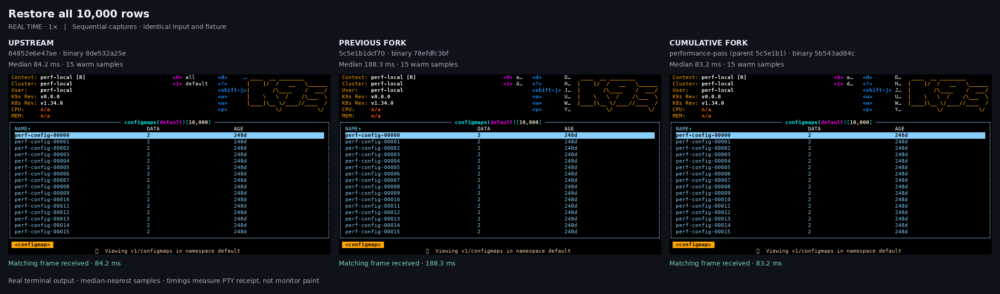
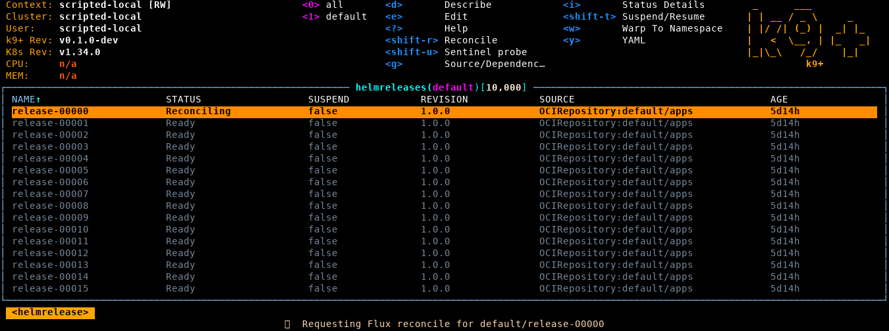
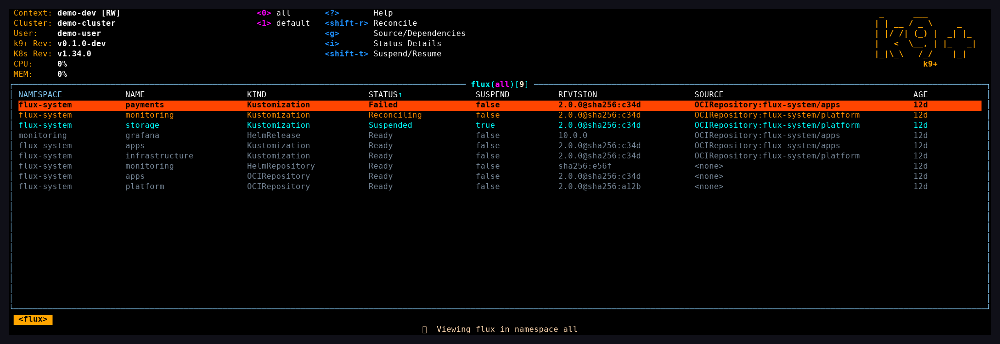
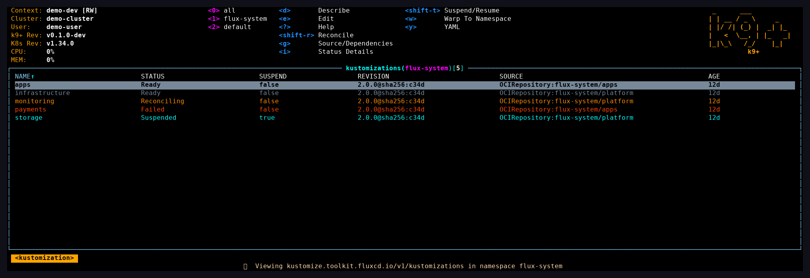
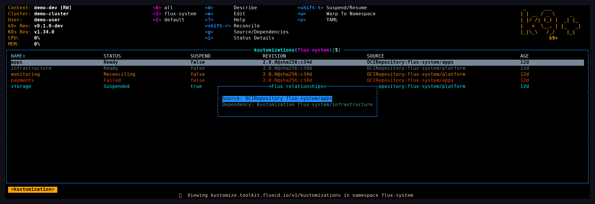
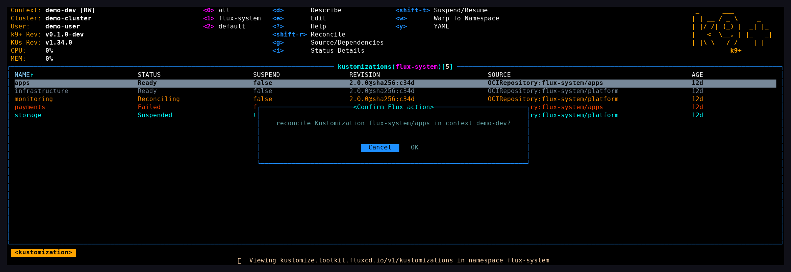
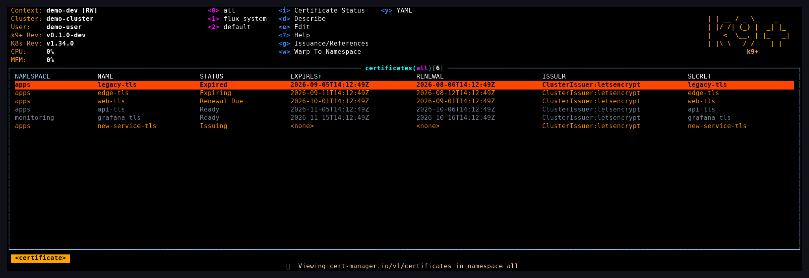
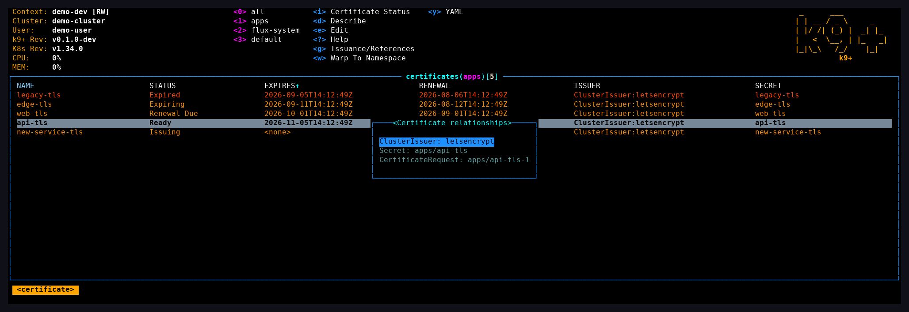
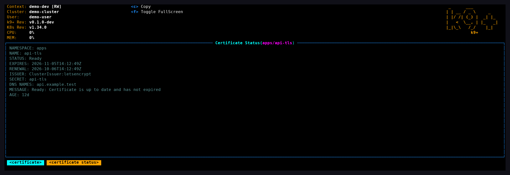

<!-- Modified for k9+; see NOTICE. -->

# k9+

**A Kubernetes terminal app with inline GitOps workflows and certificate diagnostics.**

k9+ is an independently maintained fork of [k9s](https://github.com/derailed/k9s),
licensed under Apache-2.0. It keeps the familiar terminal workflow and adds native
Flux controls, cert-manager navigation, measured performance improvements and
small UI refinements. It is not affiliated with or endorsed by the k9s maintainers.

The app displays **k9+**; its command and package name are **`k9plus`**.

## Build and run

This work is currently on the [review branch](https://github.com/jaredpricedev/k9s/pull/1).
Build from source with Go 1.25.8 or the version required by `go.mod`, Git and Make:

```sh
git clone --branch codex/flux-and-reliability-review https://github.com/jaredpricedev/k9s.git k9plus
cd k9plus
make build
./execs/k9plus
```

After placing `execs/k9plus` on your PATH, run `k9plus help` or `k9plus info`.
An optional Bash/Zsh alias gives you the display name at the prompt:

```sh
alias 'k9+=k9plus'
```

k9+ has separate configuration, plugins, state and logs. See the
[migration guide](docs/migration.md) to copy selected settings from k9s.
Existing YAML keeps its `k9s:` root for compatibility. The Go module path also
remains unchanged, so install this fork from its checkout rather than the
upstream `go install` path. Upstream package-manager commands install k9s.

## Everyday use

| Task | Command or key |
| --- | --- |
| Browse pods / deployments / logs | `:pods`, `:deployments`, `l` |
| Combined Flux dashboard | `:flux all` |
| HelmReleases and Kustomizations | `:helmreleases`, `:kustomizations` |
| Reconcile without leaving the UI | `Shift-R`, then confirm |
| Suspend / resume Flux resource | `Shift-T`, then confirm |
| Certificate health and expiry | `:certificates all` |
| Related resources / full status | `g` / `i` in supported views |
| Help / command prompt / quit | `?` / `:` / `:quit` |

Native write actions honor read-only mode and Kubernetes RBAC. Flux and
cert-manager views require the corresponding CRDs; the rest of the app works
without them. Optional CLI plugins need their respective tools.

See [Flux workflows](docs/flux.md), [certificate workflows](docs/certificates.md),
[optional plugins](plugins/README.md) and the [review findings](docs/review-2026-09-06.md).
The [upstream documentation](https://k9scli.io/topics/commands/) describes the
inherited navigation workflow; use `k9plus` and this fork's configuration paths.

## Performance comparison

These recordings predate the k9+ name and retain their original labels and measured data.

[Watch the short three-build video](assets/performance/comparison.mp4) or read the [full results and reproduction steps](docs/performance-2026-09-06.md).

[](assets/performance/comparison.mp4)

The new pass makes bulk row removal linear, reduces snapshot allocations and fixes an ASCII-rendering regression from the earlier UI polish. In five-round local microbenchmarks, removing 5,000 of 10,000 rows fell from 835 ms upstream to 1.6 ms; table rebuild plus simulated drawing fell from 33.2 ms to 25.8 ms. These are individual CPU workloads. The real-terminal demo is close to upstream for the selected filter interaction, and the report includes slower cases and timing variation.

## Inline Flux reconciliation

Press `Shift-R` in `:helmreleases` or `:flux` to confirm a background reconcile request, then keep filtering and navigating. STATUS becomes Reconciling while the request is waiting for Flux, follows controller progress, and shows the eventual result. `Shift-T` suspends/resumes inline. Older Flux plugins cannot replace these native keys; optional CLI workflows move to separate shortcuts.

[](assets/flux-inline/inline-reconcile.mp4)

[Watch the pre-rebrand inline demo](assets/flux-inline/inline-reconcile.mp4) · [Reproduce the demo and inspect its checks](assets/flux-inline/README.md)

The real TUI stays interactive while the disposable API deliberately holds its PATCH response and its simulated controller waits. This demonstrates responsiveness, not faster Helm deployments. The status-only benchmark over 10,000 releases with 64 annotations each improved from 110.5 ms to 10.0 ms median, eliminating 51.44 MB and 80,000 allocations per scan. [Raw five-round results and limits](docs/flux-status-benchmark-2026-09-06.txt).

## Flux screenshots

Captured from the running TUI using a local demo API with synthetic resources. Names, revisions and cluster details are examples; these captures do not represent live-cluster validation. Click an image to view it at full size.

**Combined Flux dashboard — `:flux all`**

See Kustomizations, HelmReleases and sources together, with health, suspension and revision. Press `i` for the complete controller message; MESSAGE is also available in wide mode.



**Native resource view — `:kustomizations flux-system`**

Inspect reconciliation status and OCI source references. Native actions appear in the shortcut bar, including `Shift-R` to reconcile and `Shift-T` to suspend or resume.



**Source and dependency navigation — `g`**

Jump from a resource to its OCI source or an explicit dependency without looking up the resource kind and namespace manually.



**Confirmed reconciliation — `Shift-R`**

The confirmation identifies the resource, namespace and context before submitting the request. Native write actions are unavailable in read-only mode.




## Certificate screenshots

These are captures of the running TUI with synthetic cert-manager resources from the same local demo API.

**Certificate health — `:certificates all`**

Scan expiry, renewal time, issuer and target Secret. Expired and expiring certificates remain visible even when an old Ready condition is still true.



**Issuance navigation — `g`**

Follow the issuer, target Secret and owned CertificateRequests, then continue to ACME Orders and Challenges. Relationships use explicit references and owner identities.



**Complete status — `i`**

Read the complete controller message and certificate timing in a scrollable dialog. Native diagnostics use cached API status; optional cmctl actions provide status, inspection and confirmed renewal.



[Capture provenance and checks](assets/k9plus/README.md). Reproduce all seven screenshots with `python scripts/capture-demo.py --binary /path/to/k9plus` after installing Python packages `Pillow` and `pyte`. See [certificate workflows](docs/certificates.md) for commands and limitations.


## License and distribution

The original [Apache-2.0 license](LICENSE), [copyright attribution](COPYING) and
source notices are retained. [NOTICE](NOTICE) identifies this independent fork;
[MODIFICATIONS.md](MODIFICATIONS.md) records its changes. The new name is not a
claim of upstream endorsement or completed trademark clearance.

Before distributing binaries, run `make licenses`. Release archives and Linux
packages include original attribution, dependency notices and the source archives
for identified MPL-covered dependencies. See [licensing and release obligations](docs/licensing.md)
for the exact scope, third-party terms and container limitations.

Contributions are welcome through issues and pull requests in
[this repository](https://github.com/jaredpricedev/k9s). Run `go test ./...`,
`golangci-lint run` and `python3 scripts/test_collect_licenses.py` before submitting
changes to the corresponding code. Keep upstream notices and mark modified files.
