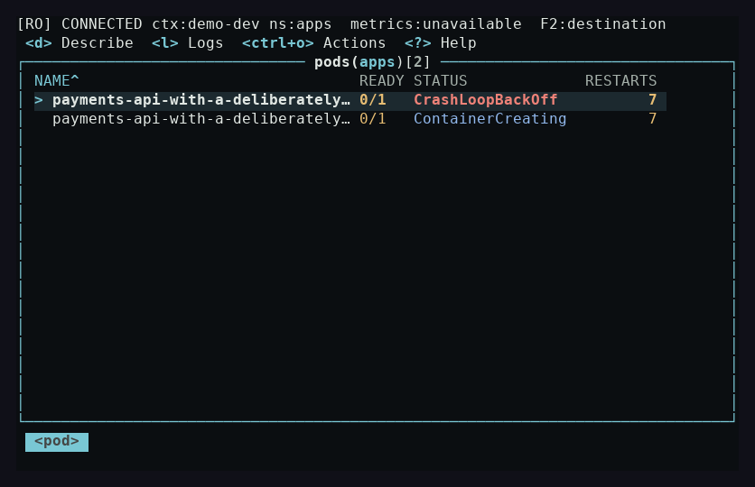
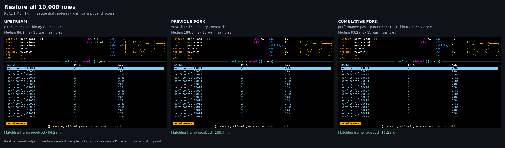
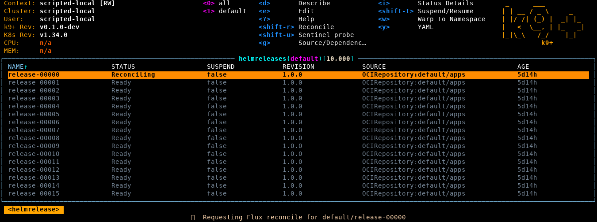
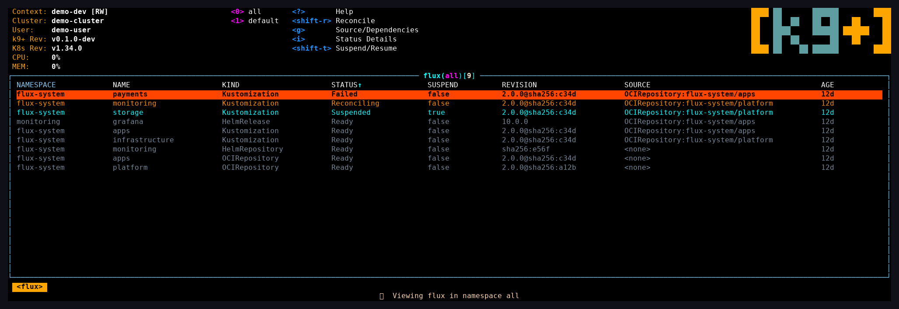
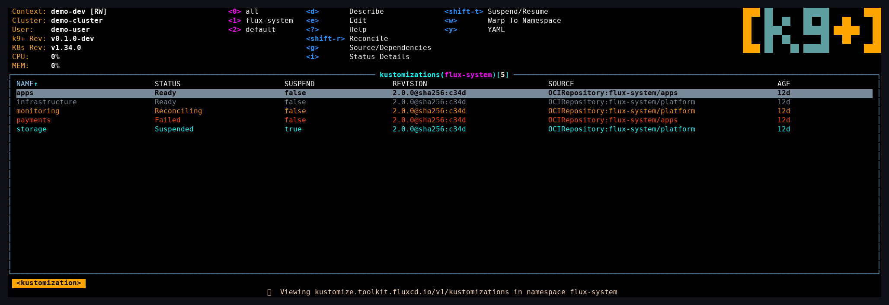
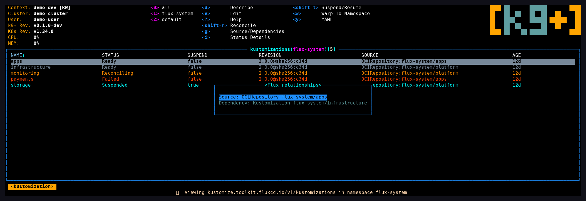
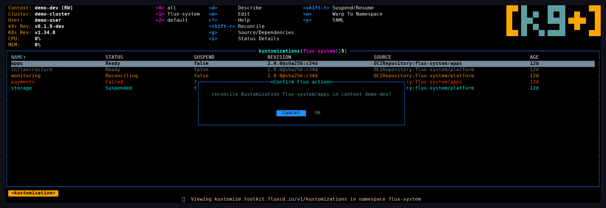
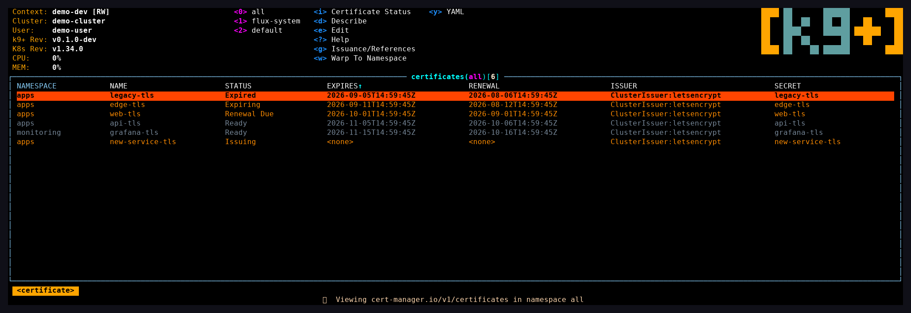
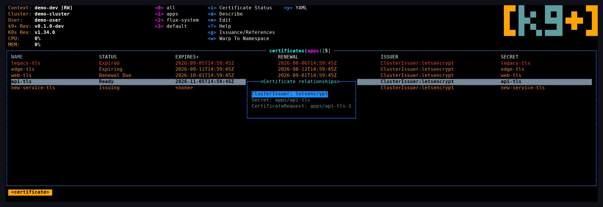
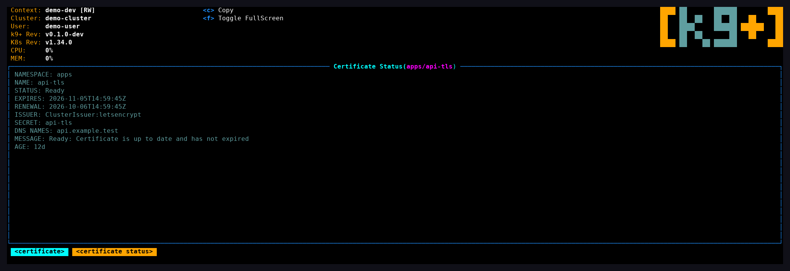

<!-- Modified for k9+; see NOTICE. -->

# k9+

**A Kubernetes terminal workspace for daily operations and investigation.**

k9+ is an independently maintained fork of [k9s](https://github.com/derailed/k9s),
licensed under Apache-2.0. It keeps the familiar terminal workflow and adds native
Flux controls, cert-manager navigation, retained troubleshooting evidence,
network flows and explicit resource comparisons. It is not affiliated with or
endorsed by the k9s maintainers.

The app displays **k9+**; its command and package name are **`k9plus`**.

## Native Cilium / Hubble

Use `:cilium` for Relay status or `Shift-H` from a pod/workload for peers,
bidirectional flows and safe detail. [Configuration and usage](docs/hubble.md).

## Build and run

Build the current default branch with Go 1.25.8 (see `go.mod`), Git and Make:

```sh
git clone https://github.com/jaredpricedev/k9s.git k9plus
cd k9plus
make build
./execs/k9plus
```

After placing `execs/k9plus` on your PATH, run `k9plus help` or `k9plus info`.
An optional Bash/Zsh alias gives you the display name at the prompt:

```sh
alias 'k9+=k9plus'
```

k9+ has separate configuration, plugins, state and logs. See the
[migration guide](docs/migration.md) to copy selected settings from k9s.
Existing YAML keeps its `k9s:` root for compatibility. The Go module path also
remains unchanged, so install this fork from its checkout rather than the
upstream `go install` path. Upstream package-manager commands install k9s.

## Daily Kubernetes workspace

The current default branch includes the [issue #8 implementation](ROADMAP.md#daily-workspace-delivery):
persistent destination identity, readable compact tables, validated filters,
shared action discovery and help, asynchronous guarded mutations, bounded log
and Hubble workbenches, retained fault evidence and workload relationships.
Explicit A/B comparison, resource pressure, capability diagnostics and portable
offline evidence open on demand.

Use `:workspace` to create and save an explicit context, namespace subset, label
selector and resource kinds. `:daily` opens its current findings queue;
`:inventory` searches the same scoped observation. Tabs retain pins, saved
searches and permission coverage. The investigation overview separates current
faults from previous terminations and retained events. See the
[daily workspace guide](docs/daily-workspace.md) for setup and limits.

Use `:review /absolute/path/manifest.yaml` for a retained local source compared
with named live targets. Select a Deployment and open `:rollout` for generation,
replica counts, owned revisions, runtime image IDs and an explicit recovery
template preview. These screens start with review; guarded writes require their
own explicit confirmation and honor read-only mode and RBAC. See
[change and release review](docs/change-release-review.md) for scope and fidelity.

Start in read-only mode and choose your destination:

```sh
./execs/k9plus --readonly --context your-context -n your-namespace
```

Use `F2` to reveal the complete destination and `Ctrl-O` to search the actions
available in the current view. Investigation snapshots retain their identity,
query and scroll position when returning from related resources.



This capture runs the application against a disposable API with synthetic Pods.
See [capture provenance](docs/evidence/ui-2026-10-04/README.md),
[first-run tasks](docs/first-run.md), [validation](docs/validation-2026-10-04.md)
and [Hubble measurements](docs/hubble-performance-2026-10-04.md).

## Everyday use

| Task | Command or key |
| --- | --- |
| Browse pods / deployments / logs | `:pods`, `:deployments`, `l` |
| Saved scopes / daily queue / scoped search | `:workspace` / `:daily` / `:inventory` |
| Application activity / reviewed changes | `:activity` / `:review /path/to/manifest.yaml`, then `b` or `:changeset` |
| Scheduled job review | `:job-review` |
| Access, capacity, storage, node maintenance | `:access`, `:capacity`, `:storage`; select a Node then `:maintenance` or `o` |
| Network path / task handoff | Select a Service then `:network-review`; `:taskbook save` / `:taskbook open` |
| Connection checks and session reconnect | `:connection`, then `r` to retry checks or `R` to reconnect the same context while retaining workspace/navigation |
| Owned port-forwards / shells / plugins | `:sessions`, then `Enter` for lifecycle details, `r` for local state or `c` to stop the selected owned session |
| Combined Flux dashboard | `:flux all` |
| HelmReleases and Kustomizations | `:helmreleases`, `:kustomizations` |
| Reconcile without leaving the UI | `Shift-R`, then confirm |
| Suspend / resume Flux resource | `Shift-T`, then confirm |
| Certificate health and expiry | `:certificates all` |
| Destination / action discovery | `F2` / `Ctrl-O` |
| Investigation tabs / related resources | `:troubleshoot`, then `1`–`5` / `g` |
| Compare observations / resource pressure | `:compare` / `:pressure` |
| Review local manifest / Deployment rollout | `:review /absolute/path.yaml` / `:rollout` |
| Capability diagnostics | `:diagnostics` |
| Capture / open offline evidence | `:evidence` / `:evidence-open /absolute/path.json` |
| Related resources / full status | `g` / `i` in supported views |
| Help / command prompt / quit | `?` / `:` / `:quit` |

Guides: [application activity](docs/application-activity.md),
[reviewed changes](docs/reviewed-change-sets.md), [scheduled jobs](docs/job-review.md),
[access](docs/toolkit/access-review.md), [capacity](docs/capacity-review.md),
[storage](docs/storage-review.md), [node maintenance](docs/node-maintenance.md),
[network paths](docs/network-path-review.md), and
[task handoffs](docs/toolkit/task-handoffs.md).

Optional review tools open only when requested. `:fleet peer-context` compares
explicitly selected contexts without discovering contexts or proving cluster
identity; `:upgrade-readiness` compares reported versions and images, not
compatibility; `:security-review` summarizes declared facts, not scanner or
admission results; `:backup-review <controller-namespace>` reviews bounded
Velero metadata, not recoverability; and `:history-review` runs bounded queries
for the selected Pod against an explicitly configured Prometheus endpoint, not
complete or UID-continuous history. Select a cert-manager Certificate and use
`:operator-review` for bounded Certificate/Issuer evidence, not independent TLS
verification; select a Service and use `:dependency-review` or Network review's
`d` / Edges tab to inspect retained relationships, not prove dependency or health.
See [fleet workspace](docs/fleet-workspace.md),
[upgrade readiness](docs/upgrade-readiness.md),
[security review](docs/security-declaration-review.md),
[backup review](docs/backup-review.md), and
[historical observability](docs/historical-observability.md),
[operator review](docs/operator-review.md), and
[dependency evidence review](docs/dependency-evidence-review.md).

Native write actions honor read-only mode and Kubernetes RBAC. Flux and
cert-manager views require the corresponding CRDs; the rest of the app works
without them. Optional CLI plugins need their respective tools.

See [Flux workflows](docs/flux.md), [certificate workflows](docs/certificates.md),
[owned local sessions](docs/local-sessions.md),
[workload relationships](docs/workload-relationships.md), [optional plugins](plugins/README.md)
and the [review findings](docs/review-2026-09-06.md).
Start with the [first-run task guide](docs/first-run.md). The
[feature matrix](ROADMAP.md) records shipped features and remaining proposals.
The [upstream documentation](https://k9scli.io/topics/commands/) describes the
inherited navigation workflow; use `k9plus` and this fork's configuration paths.

## Performance comparison

These recordings predate the k9+ name and retain their original labels and measured data.

[Watch the short three-build video](assets/performance/comparison.mp4) or read the [full results and reproduction steps](docs/performance-2026-09-06.md).

[](assets/performance/comparison.mp4)

The new pass makes bulk row removal linear, reduces snapshot allocations and fixes an ASCII-rendering regression from the earlier UI polish. In five-round local microbenchmarks, removing 5,000 of 10,000 rows fell from 835 ms upstream to 1.6 ms; table rebuild plus simulated drawing fell from 33.2 ms to 25.8 ms. These are individual CPU workloads. The real-terminal demo is close to upstream for the selected filter interaction, and the report includes slower cases and timing variation.

## Inline Flux reconciliation

Press `Shift-R` in `:helmreleases` or `:flux` to confirm a background reconcile request, then keep filtering and navigating. STATUS becomes Reconciling while the request is waiting for Flux, follows controller progress, and shows the eventual result. `Shift-T` suspends/resumes inline. Older Flux plugins cannot replace these native keys; optional CLI workflows move to separate shortcuts.

[](assets/flux-inline/inline-reconcile.mp4)

[Watch the pre-rebrand inline demo](assets/flux-inline/inline-reconcile.mp4) · [Reproduce the demo and inspect its checks](assets/flux-inline/README.md)

The real TUI stays interactive while the disposable API deliberately holds its PATCH response and its simulated controller waits. This demonstrates responsiveness, not faster Helm deployments. The status-only benchmark over 10,000 releases with 64 annotations each improved from 110.5 ms to 10.0 ms median, eliminating 51.44 MB and 80,000 allocations per scan. [Raw five-round results and limits](docs/flux-status-benchmark-2026-09-06.txt).

## Flux screenshots

Captured from the running TUI using a local demo API with synthetic resources. Names, revisions and cluster details are examples; these captures do not represent live-cluster validation. Click an image to view it at full size.

**Combined Flux dashboard — `:flux all`**

See Kustomizations, HelmReleases and sources together, with health, suspension and revision. Press `i` for the complete controller message; MESSAGE is also available in wide mode.



**Native resource view — `:kustomizations flux-system`**

Inspect reconciliation status and OCI source references. Native actions appear in the shortcut bar, including `Shift-R` to reconcile and `Shift-T` to suspend or resume.



**Source and dependency navigation — `g`**

Jump from a resource to its OCI source or an explicit dependency without looking up the resource kind and namespace manually.



**Confirmed reconciliation — `Shift-R`**

The confirmation identifies the resource, namespace and context before submitting the request. Native write actions are unavailable in read-only mode.




## Certificate screenshots

These are captures of the running TUI with synthetic cert-manager resources from the same local demo API.

**Certificate health — `:certificates all`**

Scan expiry, renewal time, issuer and target Secret. Expired and expiring certificates remain visible even when an old Ready condition is still true.



**Issuance navigation — `g`**

Follow the issuer, target Secret and owned CertificateRequests, then continue to ACME Orders and Challenges. Relationships use explicit references and owner identities.



**Complete status — `i`**

Read the complete controller message and certificate timing in a scrollable dialog. Native diagnostics use cached API status; optional cmctl actions provide status, inspection and confirmed renewal.



[Capture provenance](assets/block-logo/README.md). Reproduce all seven screenshots with `python scripts/capture-demo.py --binary /path/to/k9plus --output assets/block-logo` after installing Python packages `Pillow` and `pyte`. See [certificate workflows](docs/certificates.md) for commands and limitations.


## License and distribution

The original [Apache-2.0 license](LICENSE), [copyright attribution](COPYING) and
source notices are retained. [NOTICE](NOTICE) identifies this independent fork;
[MODIFICATIONS.md](MODIFICATIONS.md) records its changes. The new name is not a
claim of upstream endorsement or completed trademark clearance.

Before distributing binaries, run `make licenses`. Release archives and Linux
packages include original attribution, dependency notices and the source archives
for identified MPL-covered dependencies. See [licensing and release obligations](docs/licensing.md)
for the exact scope, third-party terms and container limitations.

Contributions are welcome through issues and pull requests in
[this repository](https://github.com/jaredpricedev/k9s). Run `go test ./...`,
`golangci-lint run` and `python3 scripts/test_collect_licenses.py` before submitting
changes to the corresponding code. Keep upstream notices and mark modified files.
