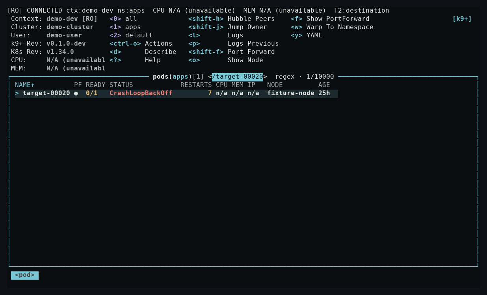
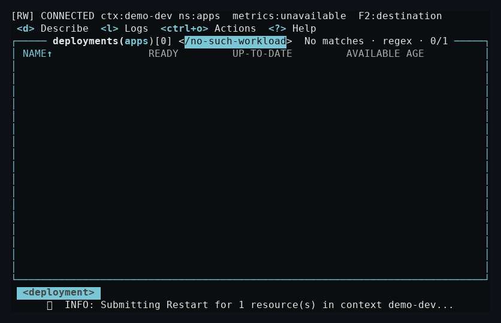

<!-- Modified for k9+; see NOTICE. -->

# Native resource-filter performance — 4 October 2026

The final 10,000-Pod terminal fixture painted committed replacement queries at a median of **80.366 ms** and p95 of **107.274 ms**. All visible-result assertions passed. The p95 exceeds the 100 ms local target by 7.274 ms; **the target is not met by this sample**.

The earlier fixture result was 641.024 ms median and 1,008.399 ms p95. This is a before/after implementation and build comparison: the baseline used **CGO_ENABLED=1**, while the final release used **CGO_ENABLED=0, netgo and stripped release flags**. The runs used the same local fixture, toolchain and hardware in idle build windows, but different build settings. They do not isolate the code change's contribution or establish a universal speedup.

## Observed terminal output

| 20 complete replacement queries | Before | Final |
| --- | ---: | ---: |
| Median | 641.024 ms | 80.366 ms |
| p95, 19th ordered sample | 1,008.399 ms | 107.274 ms |
| Maximum | 1,229.537 ms | 122.364 ms |
| p95 ≤ 100 ms | false | false |
| Asserted committed query, count and matching resource row | passed, 20/20 | passed, 20/20 |

The measured median and tail fell by 7.98× and 9.40× respectively, with the build-setting caveat above. The final capture visibly agrees on the committed `target-00020` query, `regex · 1/10000` count and selected `target-00020` resource row:



The delayed-operation fixture held a UID-conditioned restart PATCH for five seconds. Filtering painted in **13.435 ms**, and quit completed in **15.604 ms**, **0.519 seconds** into the pending API request. Resizing preserved the visible access mode and destination. This establishes responsiveness during that fixture request, not faster controller reconciliation or reversal of an accepted write.



## What changed

Resource suggestion completion previously queued filtering on every rune. The first prefix of a replacement could expand a one-row result back to 10,000 and rebuild its cells before later input was handled. Resource drafts now coalesce after a 20 ms quiet interval; Enter applies the accepted query immediately. New edits, navigation and stopped views invalidate pending work. Malformed drafts preserve the committed result and selected identity.

Regex, inverse and fuzzy submissions filter retained model data without regenerating every API object's rendered row. A changed label selector still refreshes the model's resource set. Watched data computes its projection inside the UI callback using the accepted query at that point; it cannot paint a projection computed during an older draft. Discovery of metrics availability stays outside that callback.

Focused ordinary and race regressions cover draft/Enter/escape, invalid-prefix cancellation, committed rows during watched refresh, empty-result recovery, Stop/restart, label-selector refresh boundaries and completion callbacks during listener removal. The queued-watch simulation tests both changed rows and no rows by holding the UI loop, queuing the actual Browser callback during a draft, then accepting Enter before the callback runs.

## Method and limits

Each run starts the actual binary in a real PTY at **120×34** against a disposable loopback Kubernetes API containing **10,000 retained Pods**. After the startup drain, the helper writes 20 complete queries, `/target-00001` through `/target-00020`, each followed by Enter.

A sample begins immediately before the PTY input write and ends only after parsed emitted cells contain all three: the **new committed `</target-NNNNN>` title**, **`1/10000`**, and an **actual matching resource row**. A draft prompt containing the new name with an old one-row count cannot pass. The predicate deliberately rejects title-only output as a row. p95 uses the 19th sorted observation out of 20; it is not interpolated. All samples are retained below and in the original JSON.

The elapsed time includes UTF-8 decoding, pyte parsing and screen assertions in Python. It does not measure a graphical terminal compositor or isolate model filtering, cell assembly and drawing into separate timings. Twenty samples on one machine are a local observation, not a machine-independent CI timing gate. No live cluster, Hubble Relay or human operator study is represented by this fixture.

## All samples

| Query number | Before, ms | Final, ms |
| --- | ---: | ---: |
| 1 | 495.340 | 71.243 |
| 2 | 1008.399 | 57.202 |
| 3 | 494.602 | 107.274 |
| 4 | 660.148 | 60.711 |
| 5 | 404.906 | 92.782 |
| 6 | 1229.537 | 57.377 |
| 7 | 789.604 | 91.865 |
| 8 | 814.552 | 74.836 |
| 9 | 864.176 | 122.364 |
| 10 | 621.167 | 104.062 |
| 11 | 287.733 | 66.219 |
| 12 | 625.216 | 92.949 |
| 13 | 656.832 | 54.238 |
| 14 | 547.311 | 102.604 |
| 15 | 687.177 | 56.524 |
| 16 | 475.571 | 85.897 |
| 17 | 598.046 | 57.156 |
| 18 | 337.693 | 88.354 |
| 19 | 663.361 | 66.482 |
| 20 | 907.474 | 90.206 |

## Provenance and reproduction

Both measured binaries used Go **1.25.8 linux/amd64**. The host was an **AMD EPYC 9V74** with five logical CPUs visible, a cgroup quota of **400000/100000** (four CPUs), **16 GiB** memory limit and **GOMAXPROCS=4**. Both harnesses used Python **3.12.14**, pyte **0.8.2** and Pillow **12.3.0**. Builds and Go tests were paused during each timing window.

| Identifier | Before | Final |
| --- | --- | --- |
| Binary SHA-256 | `41ebaf355805effdabab6f7bdf21353cd6ddc7e755edf779c0e2e6e18584267e` | `4261e6b0fff32209fe2d86f3a4f8d69a0e1c16de7551049d079f71033dab14d0` |
| Source checkout HEAD at measurement | `4be90d992e080c8e7775b028afae9d78423e50bb` | `2836a9672ec0fd18f352de1ff06cb8adcc586645` |
| Go source/module/journey snapshot SHA-256 | `5def0f5f5a8b703df4886c960dd0d370b587dcdd1c15a3212b3f1ad97ee2f168` | `d787a07b08391e567bc1816255b8d26110d31e6659811cd62036623ad05bb4b2` |
| Measured UTC window | 2026-10-04T01:00:54.112496+00:00 → 2026-10-04T01:01:18.533973+00:00 | 2026-10-04T01:18:40.585514+00:00 → 2026-10-04T01:18:53.329448+00:00 |

The source checkouts contained the aggregate review changes; their complete Git status and source hash are retained in each report. The final runtime filter changes were committed in foundation `cc2a6c7a`, followed by the regression commit `2836a967`. Its linker revision string remains `088791c2`, set before those commits; the binary SHA identifies exactly what was measured. The final binary's complete `go version -m` output, including `CGO_ENABLED=0`, `-tags=netgo`, linux/amd64 v1 and linker flags, is in `final.json`. The baseline report predates capture of that build metadata; its CGO1 setting is recorded from the build configuration, rather than inferred from its JSON. Both binary hashes remained unchanged during their journeys.

Install the pinned capture requirements from `scripts/terminal-requirements.txt` and the DejaVu Sans Mono font used by the screenshot renderer. Build the release through `make build` (CGO0/netgo by default). To run only these two native helpers, without the separate resource/skin/Hubble journeys:

```sh
GOMAXPROCS=4 python3 - <<'PYTHON'
import importlib.util
import json
from pathlib import Path

spec = importlib.util.spec_from_file_location("journeys", "scripts/regression-journeys.py")
journeys = importlib.util.module_from_spec(spec)
spec.loader.exec_module(journeys)
output = Path("/tmp/k9plus-native-filter")
output.mkdir(parents=True, exist_ok=True)
binary = Path("execs/k9plus").resolve()
results = [journeys.performance_journey(binary, output), journeys.slow_api_journey(binary, output)]
(output / "journeys.json").write_text(json.dumps(results, indent=2) + "\n")
PYTHON
```

Run in an idle build window with permission to bind loopback fixture ports. Record the exact binary SHA and build metadata when comparing another run. The script reports the 100 ms target as a boolean; it does not silently turn a timing miss into a passed target.

## Evidence inventory

The [manifest](evidence/filter-2026-10-04/manifest.json) records byte lengths and SHA-256 for every committed artifact. Original reports are copied byte-for-byte:

- [Before JSON](evidence/filter-2026-10-04/before.json) and [final JSON](evidence/filter-2026-10-04/final.json): all samples, environment, source and binary hashes, success/failure records and delayed-API timing.
- [Before screenshot](evidence/filter-2026-10-04/before-pods-10000.png) and [final screenshot](evidence/filter-2026-10-04/final-pods-10000.png): actual emitted terminal cells with the committed query and selected resource.
- [Final pending-restart screenshot](evidence/filter-2026-10-04/final-pending-restart.png): zero-match filter, compact access/destination indicator and delayed operation.
- [Before emitted screen text](evidence/filter-2026-10-04/before-pods-10000.txt), [final emitted screen text](evidence/filter-2026-10-04/final-pods-10000.txt) and [pending-restart emitted screen text](evidence/filter-2026-10-04/final-pending-restart.txt): small readable screen snapshots, not raw PTY byte streams.

No binaries, credentials, live resource data or large raw terminal streams are included.
